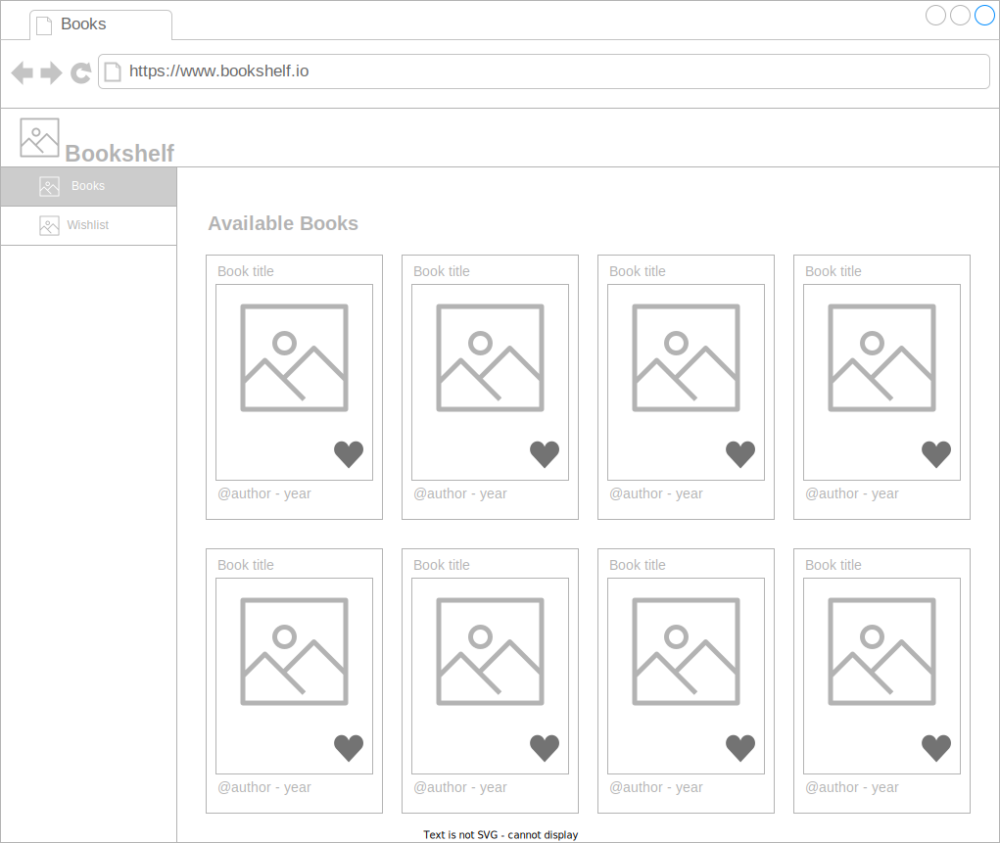

# Interface Design

## Header

The System's Header must display the Logo. No Navigation in Header as The System will have sidebar Navigation.

## Sidebar Navigation

Navigation will appear as a sidebar at the left of the User' Screen.

## Screens

The System will have two `screens`, one for displaying `available` Books and the other to display Books in the User's `Wishlist`.
Both screens will display a list of Books, with the difference given by the type of the list, `available` Books or `Wishlist`.

## Book Item

Every Book will is to be displayed on a Card, with the following information visible to the User:

- title
- author
- year
- cover

[<- Back to UX](../user.experience.md) &nbsp; [<-- Back to Index](../../README.md)